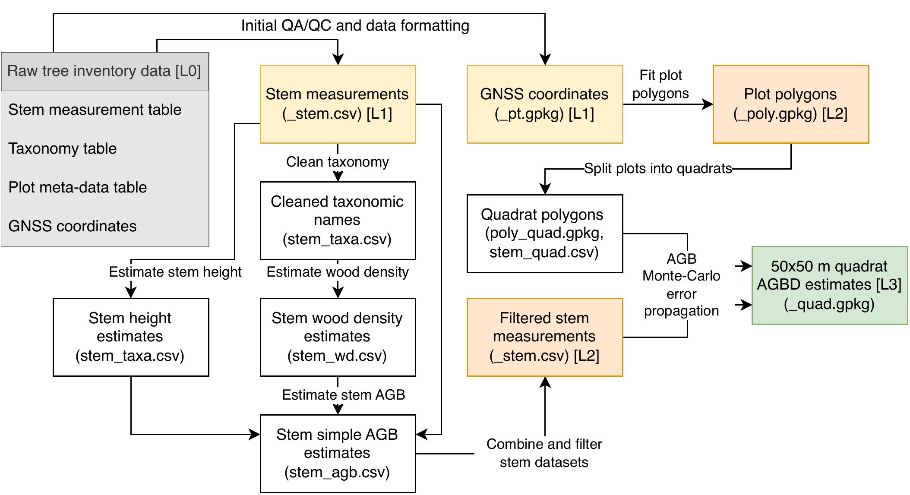

## Introduction

This purpose of this vignette is to demonstrate and document the complete
workflow for processing tree inventory data for the GEO-TREES initiative. The
code in this vignette matches the code in the R scripts elsewhere in this
repository. For automated processing of GEO-TREES tree inventory data it is
recommended to run the R scripts directly, not to use this vignette. Throughout
the vignette there are sign-posts to each R script.

Key steps:

* Format raw field data to match the GEO-TREES L0 data format
* Align taxonomic names
* Fit plot spatial polygons
* Estimate stem height, wood density, and biomass 
* Calculate summary statistics of forest structure and biomass stocks within 50x50 m quadrats 

::: {#fig-flow fig-alt="GEO-TREES tree inventory processing workflow diagram." fig-align="center"}

Flow diagram of the GEO-TREES tree inventory processing workflow. Shaded 
boxes indicate core GEO-TREES data products (L1 = yellow, L2 = orange, L3 = 
green). Decisions on how data are analysed are taken at various stages of the 
processing chain: 1) stem height estimation, 2) wood density estimation, 3) 
stem AGB estimation, 4) stem filtering, 5) polygon fitting, 6) AGBD Monte-Carlo 
error propagation. Auxiliary field datasets can be included at multiple steps 
in this workflow, e.g.: local wood density, stem height measurements, crown 
dimensions (crown-distributed AGBD).
:::

This vignette uses an anonymised dataset, based on real data from a tropical
wet forest site in South America. To illustrate the use of all supported
auxiliary datasets and processing steps, some synthetic data have been
included. 

Synthetic datasets are provided for:

* Locally-measured wood density estimates
* Locally-measured tree height estimates

## Setup

Required packages:

```{r}
#| label: setup
#| warning: false
#| message: false
#| results: hide
library(dplyr)
library(sf)  # Spatial data 
library(BIOMASS)  # AGB estimation, H:D allometry, 
library(yaml)  # read_yaml() - Read YAML files with parameters
library(rocrateR)  # rocrate() etc. - Create RO-Crate meta-data files
library(kableExtra)  # Print dataframes in Quarto documents
```

Source additional functions:

```{r}
source("../../func.R")
```

These are the functions provided by `func.R`:

```{r}
# Extract function descriptions
kable(extractRoxygen("../../func.R"))
```

Set data input and output directories:

```{r}
indir <- "./data-raw/data"
outdir <- "./out"
```

## Create L0 data

This part of the workflow will vary among sites, depending on the structure of
the raw field data. Consult the [GEO-TREES Tree Inventory Data Collection
Guidelines]() Section 16: _Data format_ for information on the GEO-TREES L0
data format. This repository also contains template files for formatting raw
data, in the `templates/` folder.

We provide various functions to help create valid GEO-TREES L0 data products:

* `colCheck()` checks whether the columns in a dataframe exactly match those in a spec. table based on their name and class (e.g. numeric, character).
* `valCheck()` runs a series of simple logical checks on the different GEO-TREES Tree Inventory L0 data objects. 
* `colGen()` creates empty columns in a dataframe if they don't already exist, using a spec. table.
* `pasteVals()` intelligently pastes values together, replacing NAs with blanks, useful for combining values in the `code` column.

## Specify processing parameters

Choices made during the processing workflow, for example the choice to use a local or regional height-diameter estimation method, should be specified in a `param.yaml` YAML configuration file. This file also defines some site meta-data and filepaths. 

There should be one `param.yaml` file for each version of the dataset.

`param.yaml` files should contain the following parameters:

* `site_id` -- Name of the site, e.g. `"Bicuar"`
* `acquisition_id` -- ID of data acquisition, e.g. `"2024-08-03"`
* `out_dir` -- Path to where processed data will be exported, e.g. `"./dat/sites/Bicuar/PDA/2024-08-03/v1"`
* `raw_dir` -- Path to the raw input data, e.g. `"./dat/sites/Bicuar/PDA/2024-08-03/L0"`
* `s3_dir` -- Optional, path to AWS S3 directory containing raw input data, e.g. `"johngodlee/GEO-TREES_PDA/dat/sites/Amacayacu/L0"`
* `quad_dim` -- Dimensions in metres of quadrats, e.g. `[50, 50]`
* `opt_s3` -- Boolean (`true`/`false`). If true, raw input data will be pulled from AWS S3
* `product_version` -- String specifying the version of the data products, e.g. `"v1"`
* `height_method` -- Method used to estimate stem height, e.g. `"regional"`, `"local"`
* `wd_method` -- Method used to estimate wood density, e.g. `"regional"`, `"local"`

Import `param.yaml`:

```{r}
# p <- yaml::read_yaml("./sites/<SITE>/<ACQUISITION>/<PRODUCTVERSION>/param.yaml")
p <- read_yaml(file.path(indir, "param.yaml"))
software_version <- read_yaml(file.path(indir, "version.yaml"))

# Merge parameters lists
param <- c(p, software_version)

# Define parameter names
param_name_vec <- c(
  "site_id",
  "acquisition_id",
  "quad_dim",
  "opt_s3",
  "s3_dir",
  "out_dir",
  "raw_dir",
  "height_method",
  "wd_method",
  "software_version",
  "product_version"
)

# Check all parameters present
if (all(sort(names(param)) != sort(param_name_vec))) {
    stop("The following parameters must be named in ./param.yaml: ", 
      paste(param_name_vec, collapse = ", "))
}

# Optionally load AWS S3 package
if (param$opt_s3) {
  library(paws)
}
```

## Import L0 data

For convenience, we create a list `L0` where each element is a different L0
tree-inventory dataset.

```{r}
# Import raw L0 data
L0 <- list(
  # Import stem measurements
  stem = read.csv(file.path(indir, "stem.csv")),

  # Import plot meta-data
  plot = read.csv(file.path(indir, "plot.csv")),

  # Import plot geo-location data
  pt = read.csv(file.path(indir, "pt.csv")),

  # Import taxonomy data (optional)
  taxa = read.csv(file.path(indir, "taxa.csv")),

  # Import individual local wood density estimates (optional)
  wd = read.csv(file.path(indir, "wd.csv")),

  # Import additional height-diameter measurements (optional)
  height = read.csv(file.path(indir, "hd.csv"))
)

# TODO: Import local biomass allometry
# agb_allom <- readRDS(file.path(indir, "agb_allom.rds"))

# TODO: Import local height-diameter allometry
# hd_allom <- readRDS(file.path(indir, "hd_allom.rds"))
```

## Correct taxonomy 

`02_taxa.R`

Here we combine all the taxonomic names recorded across all the L0 data
objects, then use the `BIOMASS::correctTaxo()` function to query the 
[World Flora Online](https://www.worldfloraonline.org/) (WFO) API to find
matching taxonomic names in their database. 

The argument `interactive = TRUE` means that when a name matches multiple
taxonomic names in the WFO database, users will be prompted to pick the correct
taxonomic name from a list in the R console. 

In the example dataset the taxonomic names are strings containing the genus,
species, any infra-specific epithets such as variety or subspecies, or a
higher-order taxonomic rank such as just the genus or family. Some examples:

* "_Burkea africana_"
* "_Pseudolachnostylis maprouneifolia_ var. _glabra_"
* "_Quercus_"
* "_Fagaceae_"

`correctTaxo()` also allows the user to pass separate `genus` and `species`
(species epithet) columns if your data is formatted that way.

If `useCache = TRUE`, `correctTaxo()` creates a cache object containing
previously queried taxonomic names. You can export this cache to a file to use
later to avoid having to do the slow interactive name matching multiple times. 

```{r}
# Combine taxa across tables
taxon_vec <- sort(unique(c(
  L0$stem$taxon_name,
  L0$wd$taxon_name,
  L0$height$taxon_name)))

# Load WFO cache from previous processing
wfo_path <- file.path(indir, "wfo_cache.rds")
if (file.exists(wfo_path)) { 
  loadWFOCache(wfo_path) 
}

# Check names
taxa <- BIOMASS::correctTaxo(
  genus = taxon_vec, 
  species = NULL,
  interactive = TRUE, 
  preferAccepted = TRUE,
  preferFuzzy = FALSE,
  sub_pattern = subPattern(),
  useCache = TRUE,
  useAPI = FALSE,
  capacity = 60,
  fill_time_s = 1, 
  timeout = 60)

# Optionally write WFO cache to file for future processing
# saveRDS(BIOMASS:::the$wfo_cache, file.path(outdir, "wfo_cache.rds"))
```

## Fit plot spatial polygons

`03_quad.R`

Here, we create spatial polygons representing the area of each plot, using field-measured geo-location estimates of survey points collected with GNSS devices. See the [GEO-TREES Plot Geo-location Protocol]() for more guidance on how to collect these data. We use the `BIOMASS::plotPolygonFit()` function to do this.

`plotPolygonFit()` also projects stem map coordinates into a global coordinate
reference system.

In this example we use the `method = "procrustes"` algorithm to fit the plot
polygon, but you could also use the "affine" or "exact" methods depending on
the availability and quality of the GNSS data, and the shape of the plot.

The "procrustes" method applies a rigid spatial transformation to align local
field coordinates with geographic projected coordinates. The algorithm
calculates the optimal two-dimensional translation (shifting) and rotation
needed to best fit the local plot corners to the provided GPS measurements.
Unlike the "affine" or "exact" algorithms, this method strictly preserves the
internal geometry, shape, and dimensions of the original field plot, i.e. we
trust the nominal dimensions of the field plot. By applying the resulting
rotation matrix and translation vector uniformly to both the plot corners and
the internal tree coordinates, the function ensures that all field-measured
distances and spatial relationships between trees are perfectly maintained in
the final geographic projection. This method is especially robust for
identifying outlier GPS measurements that deviate from the rigid, known shape
of the plot.

The "affine" method uses Ordinary Least Squares (OLS) linear regression to map
local field coordinates to geographic coordinates. By fitting separate linear
models for the X and Y axes, this method finds the optimal affine
transformation, allowing for translation, rotation, independent axis scaling,
and shearing that minimizes the overall squared error between the local corners
and the GPS measurements. The resulting linear models are then used to predict
the geographic locations of internal trees. While this method preserves
parallel lines and uniform point distributions, it may alter the overall scale
and internal angles of the original plot geometry.

The "exact" method requires exactly four plot corners. It determines the final
geographic location of each corner by calculating the simple average of its
corresponding GNSS measurements. To project the internal tree coordinates, the
algorithm utilizes bilinear interpolation. It calculates the proportional
distance of each tree relative to the local field corners and applies those
exact proportions to the projected GPS corners. Because this method forces the
plot's corners to strictly match the averaged GPS coordinates, the internal
geometry of the plot may be warped, meaning the geographic distances between
projected trees may not perfectly match the distances measured in the field.

```{r}
# Extract plot corners
plot_check <- BIOMASS::plotPolygonFit(
  point_data = L0$pt,
  method = "procrustes",
  rel_col = c("x_rel_m", "y_rel_m"),
  proj_col = c("rover_easting_utm_m", "rover_northing_utm_m"),
  lonlat_col = NULL,
  corner_col = "corner",
  plot_col = "plot_id",
  max_dist = 10,
  rm_outliers = TRUE,
  tree_data = L0$stem[L0$stem$plot_id %in% L0$pt$plot_id,],
  tree_rel_col = c("x_rel_m", "y_rel_m"),
  tree_plot_col = "plot_id",
  raster = NULL,
  shapefile = NULL,
  prop_tree = NULL,
  threshold_tree = NULL, 
  draw_plot = FALSE,
  ask = FALSE)
```

Next we divide the plot into 50x50 m (0.25 ha) quadrats using the
`BIOMASS::divide_plot()` function. This function also assigns stem measurements
to individual quadrats.

```{r}
# Divide plot
plot_divide <- BIOMASS::divide_plot(
  corner_data = plot_check$corner_coord,
  rel_coord = c("x_rel", "y_rel"),
  proj_coord = c("x_proj", "y_proj"),
  longlat = NULL,
  grid_size = param$quad_dim,
  grid_tol = 1,
  origin = NULL,
  tree_data = plot_check$tree_data,
  tree_coords = c("x_rel", "y_rel"),
  corner_plot_ID = "plot_ID",
  tree_plot_ID = "plot_ID",
  sd_coord = NULL, 
  n = 100)
```

Finally, we clean up the outputs of `plotPolygonFit()` and `divide_plot()` and create `sf` spatial objects. We now have the following objects:

* `plot_poly` - `sf` object with a spatial polygon for each plot.
* `quad_poly` - `sf` object with spatial polygons for each 50x50 m quadrat.
* `stem_pt` - `sf` object with spatial points for each stem measurement.

```{r}
# Create plot polygons 
plot_poly <- plot_check$polygon %>% 
  rename(plot_id = plot_ID) %>% 
  st_set_crs(unique(L0$pt$crs_epsg)) %>% 
  mutate(    
    site_id = param$site_id,
    acquisition_id = param$acquisition_id, 
    .before = everything())

# Create quadrat polygons
quad_pt <- plot_divide$sub_corner_coord %>% 
  st_as_sf(., coords = c("x_proj", "y_proj"), crs = unique(L0$pt$crs_epsg)) %>% 
  mutate(    
    site_id = param$site_id,
    acquisition_id = param$acquisition_id, 
    .before = everything()) %>% 
  rename(
    plot_id = plot_ID, 
    quadrat_id = subplot_ID,
    x_rel_m = x_rel,
    y_rel_m = y_rel)

quad_poly <- quad_pt %>% 
  group_by(site_id, acquisition_id, plot_id, quadrat_id) %>%
  summarise() %>% 
  st_convex_hull() %>%
  ungroup()

# Create stem points
stem_pt <- plot_divide$tree_data %>% 
  filter(!is.na(x_proj), !is.na(y_proj)) %>% 
  st_as_sf(., coords = c("x_proj", "y_proj"), crs = unique(L0$pt$crs_epsg)) %>% 
  dplyr::select(
    record_id,
    quadrat_id = subplot_ID)
```

## Estimate stem wood density

`04_wd.R`

Here we estimate the wood density of each stem measurement using the
`BIOMASS::getWoodDensity()` function, which uses taxonomic names to extract
wood density estimates from the Global Wood Density Database [@Zanne2009],
which we have also aligned with the World Flora Online in the `zz_wd_prep.R`
script.

```{r}
# Join taxonomy data to stem data
stem_taxa_all <- left_join(L0$stem, taxa, by = c("taxon_name" = "nameOriginal"))
```

In the example dataset there are local field-measured wood density estimates
that we can use. For `getWoodDensity()` to use them we need to summarise
individual measurements to the species-level mean and standard deviation.

```{r}
# Optionally process local wood density data
wd_summ <- L0$wd %>%
  group_by(site_id, taxon_name) %>%
  summarise(
    wood_density_n_total = sum(wood_density_n, na.rm = TRUE),
    meanWD = sum(wood_density_gcm3 * wood_density_n, na.rm = TRUE) / 
      sum(wood_density_n[!is.na(wood_density_gcm3)], na.rm = TRUE),
    sdWD = {
      # Filter to rows that have both mean and n 
      valid_rows = !is.na(wood_density_gcm3) & !is.na(wood_density_n)
      
      # if SD is NA, treat as 0 (no variance) 
      # but still account distance from grand mean
      clean_sd = ifelse(is.na(wood_density_sd_gcm3), 0, wood_density_sd_gcm3)
      
      # Components for grand variance
      ss_within  = sum((wood_density_n[valid_rows] - 1) * 
        clean_sd[valid_rows]^2, na.rm = TRUE)
      ss_between = sum(wood_density_n[valid_rows] * 
        (wood_density_gcm3[valid_rows] - meanWD)^2, na.rm = TRUE)
      
      # If wood_density_n_total <= 1, return NA; otherwise calculate SD
      if (wood_density_n_total > 1) {
        sqrt((ss_within + ss_between) / (wood_density_n_total - 1)) 
      } else {
        NA_real_
      }
    },
    .groups = "drop"
  ) %>% 
  left_join(., taxa, by = c("taxon_name" = "nameOriginal")) %>% 
  group_by(
    family = familyAccepted,
    genus = genusAccepted,
    species = speciesAccepted)
```

```{r}
# Estimate wood density for each stem measurement
wd_all <- BIOMASS::getWoodDensity(
  genus = stem_taxa_all$genusAccepted, 
  species = stem_taxa_all$speciesAccepted,
  stand = stem_taxa_all$plot_id,
  family = stem_taxa_all$familyAccepted,
  addWoodDensity = if (param$wd_method == "field") { wd_summ },
  verbose = TRUE)

# Create output dataframe
wd_out <- cbind(record_id = stem_taxa_all$record_id, wd_all)
```

## Estimate stem height

`05_height.R`

Here we estimate the height of each stem measurement. Height estimates are required for most stem AGB allometries.

There are multiple approaches to estimating stem height. In general, we recommend this approach:

If there is an appropriate existing local height-diameter allometry, use that to estimate the height of all stems in the site. A local height-diameter allometry is deemed appropriate if the underlying data approximately span the range of stem heights measured in the tree inventory data, the species composition is similar to that found in the tree inventory data, and the local conditions (water availability, temperature, topography) of the location where the underlying data were collected are similar to that of the GEO-TREES site.

Otherwise if there is no existing local height-diameter allometry available, if you have at least 50 local and reliable estimates of stem height and diameter, spanning the range of stem size across the plots, fit a local height-diameter allometry using the `BIOMASS::modelHD()` function.

Finally, if neither of the above are appropriate, use the `BIOMASS::retrieveH()` function and supply plot coordinates to estimate stem height from a regional height-diameter allometry [@Chave2014].

Where an existing local height-diameter allometry is available:

```{r}
# TODO:
```

Where sufficient local height data are available:

```{r}
# Compare height-diameter models
height_mod_comp <- modelHD(
  D = s_height$diam_cm,
  H = s_height$height_m,
  bayesian = FALSE,
  useCache = FALSE,
  drawGraph = FALSE)

# Choose best height diameter model
# Based on average bias
height_mod_best <- height_mod_comp[
  height_mod_comp$Average_bias == min(height_mod_comp$Average_bias), "method"]

# Fit best height diameter model
height_mod <- modelHD(
  D = s_height$diam_cm,
  H = s_height$height_m,
  method = height_mod_best,
  bayesian = FALSE,
  useCache = FALSE,
  drawGraph = TRUE)

# Predict with best height diameter model
height_est <- retrieveH(
  D = stem$diam_cm,
  model = height_mod)

# Create output dataframe
stem_height <- stem %>% 
  mutate(height_m_pred = height_est$H) %>% 
  dplyr::select(record_id, height_m_pred)
```

Using a regional height-diameter allometry where no height data are available:

```{r}
# Extract plot centres
plot_pt_split <- split(L0$pt, L0$pt$crs_epsg)
p_cent <- bind_rows(lapply(plot_pt_split, function(x) { 
  st_as_sf(x, coords = c("rover_easting_utm_m", "rover_northing_utm_m"), 
    crs = unique(x$crs_epsg)) %>% 
  st_transform(., 4326) 
})) %>% 
group_by(site_id, plot_id) %>% 
summarise() %>% 
st_centroid() %>% 
cbind(., st_coordinates(.)) %>% 
st_drop_geometry() %>% 
dplyr::select(plot_id, X, Y)

# Add plot centres to stem data
s_cent <- L0$stem %>% 
  left_join(., p_cent, by = "plot_id")

stopifnot(all(!is.na(s_cent$X)))
stopifnot(all(!is.na(s_cent$Y)))

# Retrieve stem heights using plot locations
height_pred <- retrieveH(
  D = s_cent$diam_cm, 
  coord = s_cent[,c("X", "Y")])

height_pred$RSE <- rep(0.243, length(height_pred$H))

s_cent$height_m_pred <- height_pred$H
s_cent$height_m_pred_rse <- height_pred$RSE

# Create output dataframe
stem_height <- s_cent %>% 
  dplyr::select(record_id, height_m_pred)
```

## Estimate stem AGB 

`06_agb_stem.R`

Here we estimate the above-ground woody biomass (AGB, `agb_Mg`) of each stem measurement using the `BIOMASS::computeAGB()` function. Generally, Equation 4 from @Chave2014 is used to estimate AGB with measurements of stem diameter (`D`), stem height (`H`), and wood density (`WD`). Because the @Chave2014 model was fitted using mostly data from tropical wet forests, it may fail to accurately capture the relationship between stem diameter, height, and volume in other vegetation types. For these sites, a local AGB allometry may be more appropriate. 

You may also choose to have different AGB allometries for different functional
groups in the tree inventory data. For example, if there are large baobab trees
(_Adansonia_ sp.), bamboos, or lianas which have drastically different
physiognomy to other trees in the dataset.

We also create some additional variables like stem basal area (`ba_m2`) and stem volume (`volume_m3`).

```{r}
# Estimate stem-level AGB
stem_agb <- L0$stem %>% 
  left_join(., wd_out, by = "record_id") %>% 
  left_join(., stem_height, by = "record_id") %>% 
  mutate(
    agb_Mg = BIOMASS::computeAGB(
      allometry = chave2014,
      D = .$diam_cm,
      WD = .$meanWD,
      H = .$height_m_pred)[[1]],
    ba_m2 = base::pi * (.$diam_cm / 2)^2 / 10000,
    volume_m3 = agb_Mg / meanWD) %>% 
  dplyr::select(
    record_id, 
    agb_Mg,
    ba_m2,
    volume_m3)
```

Where a local biomass allometry is available:

```{r}
# TODO:
```

Where some stem measurements specify a custom biomass allometry, e.g. for bamboos:

```{r}
# TODO:
```

## Filter stem data 

`07_record_fil.R`

Here we filter the tree inventory data prior to estimating above-ground biomass density in each 50x50 m quadrat. 

We apply the following filters:

TODO: Estimate missing AGB (missing diameter, missing coordinates) 
* Remove stems with no diameter measurement. 
* Remove stems that are not found within any 50x50 m quadrat.
* Remove stems with diameter less than the stated minimum diameter threshold.
* Include only living stems.
* Include only standing stems.
* Remove stems that are broken below the diameter Point of Measurement (POM).
* Remove "missing" stems. I.e. stems which were not measured during the census.
* Where stems were measured multiple times at multiple POMs, choose the highest POM, latest measurement date, and largest diameter measurement.

```{r}
# Filter stem data
record_fil <- L0$stem %>% 
  left_join(., stem_pt, by = "record_id") %>% 
  left_join(., L0$plot[,c("plot_id", "meas_diam_min_cm")], 
    by = "plot_id") %>% 
  filter(
    !is.na(diam_cm),
    !is.na(quadrat_id),
    diam_cm >= meas_diam_min_cm,
    grepl("A", code),
    grepl("S", code),
    !grepl("B", code),
    !grepl("T", code),
    !grepl("M", code)
  ) %>% 
  group_by(site_id, plot_id, tree_id, stem_id) %>% 
  slice_max(
    order_by = tibble(pom_m, measurement_date, diam_cm), 
    n = 1, 
    with_ties = FALSE) %>%
  ungroup() %>% 
  pull(record_id) %>% 
  as.character()
```

## Estimate quadrat AGBD and propagate error

`08_agb_mc.R`

Here we estimate the above-ground woody biomass density (AGBD) in each 50x50 m
quadrat using the `BIOMASS::AGBmonteCarlo()` function, which implements a
Monte-Carlo error propagation routine to provide an error-bounded estimate with
a 95% confidence interval.

First we prepare the input dataset:

```{r}
# Extract plot centres
p_cent <- plot_poly %>% 
  st_transform(., crs = 4326) %>% 
  group_by(site_id, plot_id, acquisition_id) %>% 
  summarise() %>% 
  st_centroid() %>% 
  cbind(., st_coordinates(.)) %>% 
  st_drop_geometry() %>% 
  dplyr::select(plot_id, X, Y)

# Filter stems data
stem_fil <- L0$stem %>% 
  left_join(., p_cent, by = "plot_id") %>% 
  left_join(., wd_out, by = "record_id") %>% 
  left_join(., stem_pt, by = "record_id") %>% 
  filter(record_id %in% record_fil)

# Split by quadrat
stem_split <- split(stem_fil, stem_fil$quadrat_id)
```

Then for each quadrat we run the function. The reason this looks complicated is
that firstly we have to loop through each quadrat using `lapply()`, and then
add a special case where if there are 2 or fewer stems in the quadrat the
function doesn't fail.

```{r}
# Define number of simulations
nsim <- 1000

# Run AGB MC error propagation
quad_length <- length(stem_split)
quad_agb_mc_list <- lapply(seq_along(stem_split), function(x) { 
  message(paste0(x, " / ", quad_length, " - ", names(stem_split)[x]))
  if (nrow(stem_split[[x]]) < 2) {
    out <- list(
      "meanAGB" = stem_split[[x]]$agb_Mg,
      "medAGB" = stem_split[[x]]$agb_Mg,
      "sdAGB" = NA_real_,
      "credibilityAGB" = c("2.5%" = NA_real_, "97.5%" = NA_real_),
      "AGB_simu" = NA_real_)
  } else {
    out <- BIOMASS::AGBmonteCarlo(
      D = stem_split[[x]]$diam_cm,
      WD = stem_split[[x]]$meanWD,
      coord = st_drop_geometry(stem_split[[x]][,c("X", "Y")]),
      Dpropag = "chave2004",
      errWD = stem_split[[x]]$sdWD,
      n = nsim)
    # here add HDmodel (from 05 step) so that all uncertainties are propagated
  }
})
names(quad_agb_mc_list) <- names(stem_split)

# Sum stem-level AGB simulations, to get AGBD per quadrat per simulation
quad_agb_simu <- bind_rows(lapply(names(quad_agb_mc_list), function(x) { 
  out <- data.frame(
    quadrat_id = x,
    sim = seq_len(nsim),
    sumAGB = colSums(as.matrix(quad_agb_mc_list[[x]]$AGB_simu))
  )
  rownames(out) <- NULL
  out
}))
# here can be done with BIOMASS::subplot_summary and thus includes uncertainties 
# on coordinates, needs divide_plot outputs from 03_quad

# Calculate mean and standard deviation of stem AGB
stem_agb_mc <- bind_rows(lapply(seq_along(quad_agb_mc_list), function(x) {
  simu <- quad_agb_mc_list[[x]]$AGB_simu
  if (is.matrix(simu)) {
    agb_Mg_mean <- apply(simu, 1, mean)
    agb_Mg_sd <- apply(simu, 1, sd)
  } else {
    agb_Mg_mean <- NA_real_
    agb_Mg_sd <- NA_real_
  }
  data.frame(record_id = stem_split[[x]]$record_id, agb_Mg_mean, agb_Mg_sd)
}))
```

Finally extract relevant summary statistics from the AGBD error propagation:

```{r}
# Extract summary statistics from AGB MC error propagation simulations
quad_agb_mc_summ <- bind_rows(lapply(names(quad_agb_mc_list), function(x) { 
  data.frame(
    quadrat_id = x,
    agb_Mg_sum_mc_mean = quad_agb_mc_list[[x]]$meanAGB,
    agb_Mg_sum_mc_median = quad_agb_mc_list[[x]]$medAGB,
    agb_Mg_sum_mc_sd = quad_agb_mc_list[[x]]$sdAGB,
    agb_Mg_sum_mc_se = quad_agb_mc_list[[x]]$sdAGB / nsim,
    agb_Mg_sum_mc_ci2.5 = unname(quad_agb_mc_list[[x]]$credibilityAGB[1]),
    agb_Mg_sum_mc_ci97.5 = unname(quad_agb_mc_list[[x]]$credibilityAGB[2]))
}))
```

## Compile GEO-TREES L1, L2, and L3 data products 

`09_stem_summ.R`
`10_quad_summ.R`
`11_brm.R`

Now we have everything needed to create the GEO-TREES L1, L2 and L3 data products.

```{r}
# Combine stem dataframes
stem_summ <- stem %>%
  left_join(., stem_agb, by = "record_id") %>% 
  left_join(., stem_agb_mc, by = "record_id") %>% 
  left_join(., stem_height, by = "record_id") %>% 
  left_join(., stem_wd, by = "record_id") %>% 
  left_join(., taxa, by = c("taxon_name" = "nameOriginal")) %>% 
  left_join(., stem_pt, by = "record_id") %>% 
  # {
  #   if (exists("taxon")) {
  #     left_join(., taxon, by = "taxon_name")
  #   } else { . }
  # } %>% 
  st_sf()
```

```{r}
# Calculate area of each quadrat
quad_poly_area <- st_drop_geometry(quad_poly)
quad_poly_area$quadrat_area_ha <- drop_units(st_area(quad_poly)) * 0.0001

# Calculate quadrat summary values
quad_summ <- stem_summ %>% 
  filter(record_id %in% record_fil) %>% 
  st_drop_geometry() %>% 
  group_by(site_id, acquisition_id, plot_id, quadrat_id, census_date) %>% 
  summarise(
    n_stem = n(),
    ba_m2_sum = sum(ba_m2, na.rm = TRUE),
    volume_m3_sum = sum(volume_m3, na.rm = TRUE),
    diam_cm_mean = mean(diam_cm, na.rm = TRUE),
    diam_cm_max = max(diam_cm, na.rm = TRUE),
    diam_cm_q80 = quantile(diam_cm, 0.8, na.rm = TRUE),
    diam_cm_q90 = quantile(diam_cm, 0.9, na.rm = TRUE),
    diam_cm_q95 = quantile(diam_cm, 0.95, na.rm = TRUE),
    height_m_pred_mean = mean(height_m_pred, na.rm = TRUE),
    height_m_pred_max = max(height_m_pred, na.rm = TRUE),
    height_m_pred_q80 = quantile(height_m_pred, 0.8, na.rm = TRUE),
    height_m_pred_q90 = quantile(height_m_pred, 0.9, na.rm = TRUE),
    height_m_pred_q95 = quantile(height_m_pred, 0.95, na.rm = TRUE),
    lorey_height_m = sum(ba_m2 * height_m_pred, na.rm = TRUE) / sum(ba_m2, na.rm = TRUE),
    meanWD_mean = mean(meanWD, na.rm = TRUE),
    meanWD_wm_ba = weighted.mean(meanWD, ba_m2),
    .groups = "drop_last") %>% 
  ungroup() %>% 
  left_join(., quad_agb, by = "quadrat_id") %>% 
  left_join(., quad_poly_area, by = c("site_id", "acquisition_id", "plot_id", "quadrat_id")) %>% 
  mutate(
    across(
      starts_with(c("n_stem_", "ba_m2_", "volume_m3_", "agb_Mg")), 
      ~.x / quadrat_area_ha, .names = "{.col}_ha"),
    across(
      .cols = where(~inherits(.x, "units")), 
      .fns = drop_units),
    across(
      everything(), 
      ~ifelse(.x == -Inf, NA_real_, .x))) 

# Add quadrat polygons, fill in quadrats with no trees
quad_summ_out <- quad_poly %>% 
  left_join(., quad_summ, 
    by = c("site_id", "acquisition_id", "plot_id", "quadrat_id")) %>% 
  mutate(
    across(all_of(c(
      "n_stem", 
      "ba_m2_sum",
      "ba_m2_sum_ha",
      "volume_m3_sum",
      "volume_m3_sum_ha",
      "agb_Mg_sum_mc_mean", 
      "agb_Mg_sum_mc_median",
      "agb_Mg_sum_mc_mean_ha", 
      "agb_Mg_sum_mc_median_ha")), ~ifelse(is.na(.x), 0, .x))) 
```

Create L1, L2 and L3 data products.

Each product has an associated "RO-Crate" file which records the version of the
code and the input data sources so they can be reproduced.

* L1 re-formatted stem measurements.
* L1 re-formatted plot geo-location points
* L1 re-formatted plot meta-data
* L2 stem AGB estimates.
* L1 plot polygons.
* L3 AGBD estimates within plot quadrats.

```{r}
# Prepare L1 stems dataset
L1_stem <- stem_summ %>% 
  st_transform(., 4326) %>% 
  bind_cols(., st_coordinates(.)) %>% 
  st_drop_geometry() %>% 
  dplyr::select(
    BRM_site = site_id,
    Acquisition = acquisition_id,
    Plot_name = plot_id,
    Tree_label = tree_id,
    Stem_label = stem_id,
    Botany_genus = genusAccepted,
    Botany_species = speciesAccepted,
    Botany_author = authorAccepted,
    Botany_family = familyAccepted,
    Position_x = x_rel_m,
    Position_y = y_rel_m,
    Longitude = X,
    Latitude = Y,
    Diameter = diam_cm,
    POM = pom_m,
    Total_height = height_m,
    Code = code)

# Prepare L1 GNSS dataset
L1_pt <- plot_pt

# Prepare L1 plot meta-data 
L1_plot <- plot

# Prepare L2 stems dataset
L2_stem <- stem_summ %>% 
  filter(record_id %in% record_fil) %>% 
  st_transform(., 4326) %>% 
  bind_cols(., st_coordinates(.)) %>% 
  st_drop_geometry() %>% 
  mutate(
    agb_Mg_mean = ifelse(is.na(agb_Mg_mean), agb_Mg, agb_Mg_mean)) %>% 
  dplyr::select(
    BRM_site = site_id,
    Acquisition = acquisition_id,
    Plot_name = plot_id,
    Tree_label = tree_id,
    Stem_label = stem_id,
    Longitude = X,
    Latitude = Y,
    WD_stem_estimate = meanWD,
    WD_stem_uncertainty = sdWD,
    AGB_stem_estimate = agb_Mg_mean,
    AGB_stem_uncertainty = agb_Mg_sd,
    Height_stem_estimate = height_m_pred)#,
    # TODO: Height_tree_uncertainty = )

# Prepare L1 plot polygons dataset 
L2_poly <- plot_poly %>% 
  dplyr::select(
    BRM_site = site_id,
    Acquisition = acquisition_id,
    Plot_name = plot_id)

# Check all values filled
stopifnot(all(!is.na(L2_stem$AGB_tree_estimate)))
# stopifnot(all(!is.na(L2_stem$AGB_tree_uncertainty)))

# Prepare L3 quadrat dataset
L3_quad <- quad_summ %>% 
  dplyr::select(
    BRM_site = site_id,
    Acquisition = acquisition_id,
    Plot_name = plot_id,
    Quadrat_name = quadrat_id,
    AGBD_stand_estimate = agb_Mg_sum_mc_mean_ha,
    AGBD_stand_uncertainty = agb_Mg_sum_mc_sd_ha,
    Height_stand_estimate = height_m_pred_max,
    # Height_stand_uncertainty = # TODO: Canopy height standard deviation, reporting the L2 uncertainty propagated to stand-level estimate. 
    Basal_area = ba_m2_sum_ha,
    Lorey_height = lorey_height_m,
    Wood_density = meanWD_wm_ba) 

# Check all values filled
stopifnot(all(!is.na(L3_quad$AGBD_stand_estimate)))
# stopifnot(all(!is.na(L3_quad$AGBD_stand_uncertainty)))

# Construct output filenames
L1_filename <- paste(
    param$site_id, 
    "PDA", 
    param$acquisition_id, 
    "L1", 
    software_version_sanit, 
  sep = "_")

L2_filename <- paste(
    param$site_id, 
    "PDA", 
    param$acquisition_id, 
    "L2", 
    software_version_sanit, 
  sep = "_")

L3_filename <- paste(
    param$site_id, 
    "PDA", 
    param$acquisition_id, 
    "L3", 
    software_version_sanit, 
  sep = "_")

# Write L1 dataset to file
write.csv(L1_stem, file.path(L_dir_list[["L1"]], paste0(L1_filename, "_stem", ".csv")), row.names = FALSE)
write.csv(L1_plot, file.path(L_dir_list[["L1"]], paste0(L1_filename, "_plot", ".csv")), row.names = FALSE)
write.csv(L1_pt, file.path(L_dir_list[["L1"]], paste0(L1_filename, "_pt", ".csv")), row.names = FALSE)

# Write L2 dataset to file
write.csv(L2_stem, file.path(L_dir_list[["L2"]], paste0(L2_filename, "_stem", ".csv")), row.names = FALSE)
st_write(L2_poly , file.path(L_dir_list[["L1"]], paste0(L1_filename, "_poly", ".gpkg")), delete_dsn = TRUE) 

# Write L3 dataset to file
st_write(L3_quad, file.path(L_dir_list[["L3"]], paste0(L3_filename, "_quad", ".gpkg")), delete_dsn = TRUE)

# Construct RO-crates

# Author 
me <- entity(
  x = "#john-godlee",
  type = "Person",
  name = "John L. Godlee",
  email = "GodleeJ@si.edu"
)

# Affiliation
aff <- entity(
  x = "#si-org",
  type = "Organization",
  name = "Smithsonian Institution"
)

# License
lic <- entity(
  x = "TERMS.md",
  type = c("File", "CreativeWork") 
)

# Input directory
indir <- entity(
  x = paste0(param$raw_dir, "/"),
  type = "Dataset",
  description = "Directory containing raw L0 data."
)

# Output files
L1_stem_outfile <- entity(
  x = file.path(L_dir_list[["L1"]], paste0(L1_filename, "_stem", ".csv")),
  type = "File",
  description = "L1 re-formatted stem measurements.",
  encodingFormat = "text/csv"
)

L1_pt_outfile <- entity(
  x = file.path(L_dir_list[["L1"]], paste0(L1_filename, "_pt", ".csv")),
  type = "File",
  description = "L1 re-formatted plot geo-location points",
  encodingFormat = "text/csv"
)

L1_plot_outfile <- entity(
  x = file.path(L_dir_list[["L1"]], paste0(L1_filename, "_plot", ".csv")),
  type = "File",
  description = "L1 re-formatted plot meta-data",
  encodingFormat = "text/csv"
)

L2_stem_outfile <- entity(
  x = file.path(L_dir_list[["L2"]], paste0(L2_filename, "_stem", ".csv")),
  type = "File",
  description = "L2 stem AGB estimates.",
  encodingFormat = "text/csv"
)

L2_poly_outfile <- entity(
  x = file.path(L_dir_list[["L1"]], paste0(L1_filename, "_poly", ".gpkg")),
  type = "File",
  description = "L1 plot polygons.",
  encodingFormat = "text/csv"
)


L3_quad_outfile <- entity(
  x = file.path(L_dir_list[["L3"]], paste0(L3_filename, "_quad", ".gpkg")),
  type = "File",
  description = "L3 AGBD estimates within plot quadrats.",
  encodingFormat = "application/geopackage+sqlite3"
)

# Parameters file
yaml <- entity(
  x = "param.yaml",
  type = "File",
  description = "Configuration parameters.",
  encodingFormat = "application/yaml"
)

# Software 
code <- entity(
  x = paste0("#PDA_processing_", param$software_version),
  type = c("SoftwareApplication", "SoftwareSourceCode"),
  name = "GEO-TREES AGBD processing pipeline",
  version = param$software_version,
  url = paste0("https://github.com/GEO-TREES/PDA_processing/releases/tag/", param$software_version),
  programmingLanguage = "R"
)

# Execution action
exec <- entity(
  x = "#run-tree_inventory_pipeline",
  type = "CreateAction",
  name = "Tree inventory pipeline execution",
  description = "Execute tree inventory pipeline to generate data products",
  endTime = strftime(Sys.time(), format = "%Y-%m-%dT%H:%M:%SZ", tz = "UTC")
)

L_outfile_list <- list(
  "L1" = list(
    "L1_stem" = L1_stem_outfile,
    "L1_plot" = L1_plot_outfile,
    "L1_pt" = L1_pt_outfile
  ),
  "L2" = list(
    "L2_stem" = L2_stem_outfile,
    "L2_poly" = L2_poly_outfile
  ),
  "L3" = list(
    "L3_quad" = L3_quad_outfile
  )
)

# Initialize crates, add entities and relationships
rocrate_list <- lapply(names(L_outfile_list), function(x) { 
  rc <- rocrate(
    context = "https://w3id.org/ro/crate/1.2/context",
    datePublished = as.character(Sys.Date()),
    name = paste("GEO-TREES Bicuar PDA", x)
  ) |> 
    add_entity(me) |>
    add_entity(aff) |>
    add_entity(lic) |>
    add_entity(indir) |>
    add_entity(yaml) |>
    add_entity(code) |>
    add_entity(exec)

  for (i in L_outfile_list[[x]]) {
    rc <- rc |> add_entity(i)
  }

  L_outfile_id_list <- unname(lapply(L_outfile_list[[x]], function(i) { 
    list(`@id` = i$`@id`) 
  }))

  rc |>
    add_entity_value(id = "./", key = "author", value = list(`@id` = me$`@id`)) |>
    add_entity_value(id = "./", key = "license", value = list(`@id` = lic$`@id`)) |>
    add_entity_value(id = "./", key = "hasPart", 
      value = c(
        list(
          list(`@id` = yaml$`@id`),
          list(`@id` = indir$`@id`),
          list(`@id` = lic$`@id`)
        ),
        L_outfile_id_list
      )
    ) |>
    add_entity_value(id = "./", key = "mentions", value = list(
        list(`@id` = exec$`@id`),
        list(`@id` = code$`@id`)
      )) |>
    add_entity_value(id = me$`@id`, key = "affiliation", value = list(`@id` = aff$`@id`)) |>
    add_entity_value(id = exec$`@id`, key = "object", 
      value = list(
        list(`@id` = yaml$`@id`),
        list(`@id` = indir$`@id`)
      )) |>
    add_entity_value(id = exec$`@id`, key = "result", value = L_outfile_id_list) |>
    add_entity_value(id = exec$`@id`, key = "instrument", value = list(`@id` = code$`@id`))
})
names(rocrate_list) <- names(L_outfile_list)

# Write crates to file
lapply(names(rocrate_list), function(x) { 
  write_rocrate(rocrate_list[[x]], 
    file.path(L_dir_list[[x]], "ro-crate-metadata.json"))
})

# Copy param.yaml to each data output
lapply(L_dir_list, function(x) { 
  file.copy("./param.yaml", file.path(x, "param.yaml"))
})
```

## Next steps

The L3 Tree Inventory data product is passed to the AGBD geo-spatial modelling
workflow to produce landscape-level estimates of AGBD at 50 x 50 m gridded
resolution, in combination with the ALS L3 data products.

